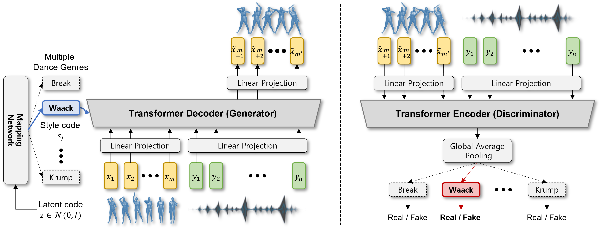

# MNET
Official PyTorch implementation of the paper ["A Brand New Dance Partner:Music-Conditioned Pluralistic Dancing Synthesized by Multiple Dance Genres", CVPR 2022](https://openaccess.thecvf.com/content/CVPR2022/html/Kim_A_Brand_New_Dance_Partner_Music-Conditioned_Pluralistic_Dancing_Controlled_by_CVPR_2022_paper.html).
Please visit our [website](https://jw09191.github.io/MNET_CVPR22/) for more details.

## Framework
We propose MNET, a novel and scalable approach that can perform music-conditioned pluralistic dance generation synthesized by multiple dance genres using only a single model. Here, we learn a dance-genre aware latent representation by training a conditional generative adversarial network leveraging Transformer architecture.


## 1. Getting started
```bash
# clone this repo:
git clone https://github.com/jw09191/MNET
cd MNET

# [OPTIONAL] create conda environment
conda create -n mnet python=3.8
conda activate mnet

# install requirements
pip install -r requirements.txt
```

## 2. Download the datasets
In our experiment, we use AIST++. For more information about the dataset, please check this [page](https://google.github.io/aistplusplus_dataset/).
Please download the annotated motion datasets from [here](https://storage.cloud.google.com/aist_plusplus_public/20210308/motions.zip), 
and unzip them as ``./data/AIST++/motions/`` folder.
Please download the music pieces (wav) from [here](https://aistdancedb.ongaaccel.jp/v1.0.0/audio/wav.zip), 
and unzip them as ``./data/AIST++/wav/`` folder. And please download SMPL models [here](https://smpl.is.tue.mpg.de/),
and copy the downloaded 'male' SMPL model to ``./data/AIST++/SMPL_DIR/`` folder.

## 3. How to use MNET
### Training
```bash
# train on CPU
python train.py experiment=AISTPP trainer.gpus=0

# train on single GPU
python train.py experiment=AISTPP trainer.gpus=1

# train with DDP (Distributed data Parallel) (4 GPUs)
python train.py experiment=AISTPP trainer.gpus=4 +trainer.strategy=ddp
```

### Pretrained models
You can download pretrained models from [here](https://drive.google.com/drive/folders/1w75KhHhzhQXJY7R-fPQSVDvjR4iIfUiJ?usp=sharing) (Google Drive),
and move them to ``./logs/pretrain/`` folder.

### Visualization
You can choose .pkl data from ``./data/AIST++/motions`` and the generated dance videos are saved in ``./logs/pretrain/demos/`` folder.
#### Generate diverse dance
```bash
# example
python demo.py -l pretrain -p gBR_sBM_cAll_d04_mBR0_ch01.pkl -t diversity 
```

#### Generate dance controlled by dance genre
```bash
# example
python demo.py -l pretrain -p gBR_sBM_cAll_d04_mBR0_ch01.pkl -t synthesis 
```

## 4. Citation
    @InProceedings{Kim_2022_CVPR,
        author    = {Kim, Jinwoo and Oh, Heeseok and Kim, Seongjean and Tong, Hoseok and Lee, Sanghoon},
        title     = {A Brand New Dance Partner: Music-Conditioned Pluralistic Dancing Controlled by Multiple Dance Genres},
        booktitle = {Proceedings of the IEEE/CVF Conference on Computer Vision and Pattern Recognition (CVPR)},
        month     = {June},
        year      = {2022},
        pages     = {3490-3500}
    }
Our code is released under MIT License.


